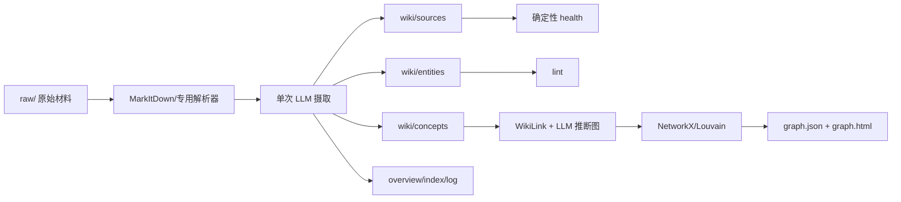
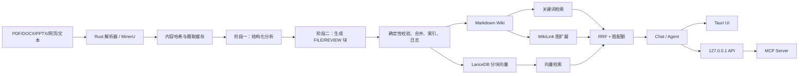
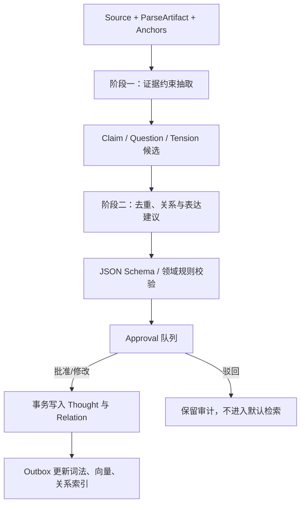
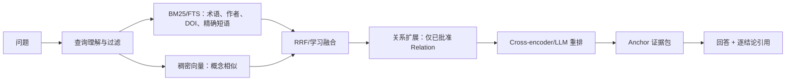

# 两个 LLM Wiki 项目的技术路径与 Nexogenesis 借鉴方案

> 审阅对象：`llm-wiki-agent-main`、`llm_wiki-main`  
> 审阅日期：2026-07-24  
> 适配基线：[Nexogenesis“思维承载体”技术栈与实施架构](./Nexogenesis_思维承载体技术栈_2026.md)

## 0. 结论先行

  两个项目都值得参考，但价值所在不同。`llm-wiki-agent-main` 展示了一个极简、透明、可迁移的“文件即知识库”方案：原始材料与生成知识分层、Markdown 与 WikiLink 作为开放格式、确定性健康检查与语义检查分层、图谱可从文件重建。`llm_wiki-main` 则展示了完整桌面产品的工程闭环：多格式解析、两阶段摄取、长文档断点续跑、持久化任务队列、嵌入式向量检索、关键词—向量—图邻居融合、人工审阅、本地 API、MCP 和 Agent 工具权限。

  对 Nexogenesis 最重要的判断是：可以大量借鉴二者的“管线和工程控制”，不能直接继承二者的“知识对象模型”。两个项目的主要对象仍是文档和 Wiki 页面，引用通常止于整个来源文件或页面；Nexogenesis 要承载的是可归属、可修订、可审批、可追溯到精确证据位置的思想对象。因此，目标闭环仍应是：

```text
Source → Anchor → Candidate Thought → Approval
       → Indexed Thought / Relation → Evidence-backed Retrieval → Cited Answer
```

  建议优先吸收以下八项：

1. 原始来源不可变、派生知识可重建的目录契约；
2. `purpose` 与 `schema` 分离，分别约束“为什么建库”和“允许生成什么对象”；
3. “语义分析”和“文件/对象生成”两阶段摄取；
4. 哈希缓存、幂等补偿、可恢复队列和长文档检查点；
5. 关键词、向量和一跳关系扩展组成的混合检索；
6. 确定性健康检查与昂贵语义检查分层；
7. AI 只提交候选审阅项，高风险关系与思想由用户批准；
8. 桌面端、本地 API 与 MCP 共用同一领域服务，不复制业务逻辑。

  明确不应原样照搬的做法包括：根据断链自动生成实体页、把模型推断边直接当成知识事实、仅以 Wiki 页面作为引文、固定经验权重却不做本域评测、依靠自由文本分隔符作为长期协议、允许本地 API 无令牌访问，以及直接复制 GPLv3 主项目代码进入许可证不兼容的产品。

## 1. 审阅范围与证据边界

  本文不是根据 README 做功能转述，而是交叉阅读了两个项目的依赖、核心代码、测试入口和许可证。重点追踪了摄取、解析、文件写入、缓存、队列、检索、嵌入、图谱、审阅、来源删除、本地 API、MCP、Agent 权限等数据流。

| 项目 | 本地版本线索 | 主要技术 | 许可证证据 | 审阅性质 |
|---|---:|---|---|---|
| `llm-wiki-agent-main` | `pyproject.toml` 0.1.0 | Python、Markdown、LiteLLM、NetworkX、MarkItDown | 根目录 `LICENSE` 为 MIT | 源码静态审阅 |
| `llm_wiki-main` | `package.json` 与 Cargo 均为 0.6.5 | React 19、TypeScript、Tauri 2、Rust、LanceDB、Graphology | 根目录 `LICENSE` 为 GPLv3 | 源码静态审阅 |
| `llm_wiki-main/mcp-server` | `package.json` 0.4.25 | Node.js、TypeScript、MCP SDK | 包元数据声明 MIT，但本地未发现独立 `LICENSE` 文件 | 源码静态审阅，分发前需再确认许可边界 |

  当前两个项目均未安装 `node_modules`，Rust 目录也没有构建产物，所以本文没有声称“已运行全部测试”或“已验证 README 中的性能指标”。代码中存在大量单元测试和 Rust 测试；本次统计到测试定义线索数百处，但这只能证明测试投入较多，不能替代实际通过记录。

  `llm_wiki-main` README 声称开启向量搜索后整体召回率由 58.2% 提升到 71.4%，但在已审阅材料中没有发现语料、问题集、相关性标注、`k` 值、置信区间或复现实验说明。因此本文只把它记为“项目自报结果”，不把它当成 Nexogenesis 选型证据。Nexogenesis 仍需使用自己的中文学术与私人思想语料建立黄金集。

## 2. 两个项目的总体技术路径

### 2.1 `llm-wiki-agent-main`：文件系统驱动的轻量知识库



  该项目的核心不是一个常驻服务，而是一套仓库协议：Agent 读取 `AGENTS.md`，把 `raw/` 视为不可修改的来源层，把 `wiki/` 视为可生成和可维护的知识层，把 `graph/` 视为可重建产物。独立 Python 工具可以完成摄取、查询、健康检查、语义检查、图谱构建和来源刷新。

  优点是部署与迁移成本极低，所有内容可直接阅读、搜索、Git 管理和人工修订。缺点是事务、一致性、细粒度证据、并发和审批能力较弱；很多正确性依赖单次提示、文件命名和事后扫描。

### 2.2 `llm_wiki-main`：Tauri 本地桌面知识工作台



  该项目把本地知识库做成了完整桌面应用。React/TypeScript 负责交互和大部分管线编排，Rust/Tauri 负责本地文件、解析、向量库、HTTP 服务、进程工具和操作系统集成。它的工程价值明显高于它的知识建模价值：恢复、取消、重试、输入边界、路径约束、缓存收敛和跨项目隔离都有实际代码。

  主要风险是复杂度集中。`ingest.ts`、Rust Agent runtime、本地 API 服务和搜索模块都已达到很大的单文件规模。Nexogenesis 可以吸收它们的机制，但应按领域边界拆分，避免形成难测试、难替换的“万能管线文件”。

### 2.3 横向对比

| 维度 | `llm-wiki-agent-main` | `llm_wiki-main` | 对 Nexogenesis 的意义 |
|---|---|---|---|
| 产品形态 | Agent 可操作的仓库模板 | 本地桌面应用 | 保留 Web 内核，桌面壳按真实离线需求提前或后置 |
| 事实底座 | Markdown 文件 | Markdown + 本地状态 + LanceDB | Markdown 作为可迁移快照，结构化数据库承担事务 |
| 来源模型 | `raw/` 与 source page | `raw/sources`、来源身份、摘要页 | 应升级为 `Source + ParseArtifact + Anchor` |
| 摄取 | 单次 LLM 生成多个页面 | 分析→生成，两阶段 | 采用两阶段，但输出候选对象而非直接转正 |
| 长文档 | 基本整篇输入 | 语义分块、滚动摘要、检查点 | 值得改造，必须为结论保留原文 Anchor |
| 检索 | 标题/词项匹配，必要时让 LLM 选页 | 关键词 + 向量 + 一跳图扩展 | 采用混合检索，并用本域评测调参 |
| 图谱 | 显式边 + LLM 推断边 + Louvain | WikiLink、共享来源、邻居、类型亲和 | 关系推断只能生成候选，不可自动成为事实边 |
| 健康检查 | health/lint 分层清晰 | lint、图洞察、队列与缓存自检 | 直接采用“零 LLM 预检 + 语义审计”分层 |
| 审批 | 查询保存前询问；其他写入较自动 | 独立 REVIEW 队列 | 映射为统一 `Approval` 领域对象 |
| 删除 | 主要靠刷新和重建 | 来源删除、共享页保留、链接/向量级联清理 | 来源生命周期模式值得采用 |
| 扩展接口 | CLI/Agent 指令 | 本地 API + MCP | 领域服务单源，多适配器复用 |
| 许可证 | MIT，易参考与复用 | 主项目 GPLv3 | 可学习模式；复制主项目代码需法律审查 |

## 3. 可借鉴方案一：开放、可重建的知识目录

### 3.1 项目做法

  `llm-wiki-agent-main/AGENTS.md` 明确规定：

- `raw/` 保存不可修改的原始材料；
- `wiki/` 保存来源摘要、实体、概念和综合；
- `index.md` 是目录；
- `log.md` 是追加式操作记录；
- `overview.md` 是跨来源综合；
- `graph/` 是自动生成结果。

  `llm_wiki-main` 在此基础上增加了项目级 `purpose.md` 与 `schema.md`。前者描述知识库目标，后者约束可用页面类型和路由；生成时读取两者，写入时再用应用层规则校验模型输出是否被允许。

### 3.2 为什么值得采用

  这个设计形成了三个重要不变量：

1. 原始材料不被 AI 改写；
2. 生成知识可以删除并从来源重建；
3. 用户不依赖某个数据库或供应商才能读取自己的内容。

### 3.3 对 Nexogenesis 的改造

  建议保留目录语义，但不要让 Markdown 成为唯一运行时数据库：

```text
project/
├── sources/                 # 原始 Source，内容寻址、默认不可变
├── parse-artifacts/         # 可重算的 Markdown/布局/OCR 结果
├── exports/                 # Thought、Synthesis、Theory 的 Markdown 导出
├── media/                   # 图片、表格和页面渲染
├── evaluations/             # 黄金问题与回归结果
└── .nexogenesis/            # 检查点、队列、索引版本；不作为用户内容真相
```

  PostgreSQL 或桌面版 SQLite 保存 `Source`、`Anchor`、`Thought`、`Relation`、`Approval`、版本和审计事件。Markdown 是可读、可导出、可重建的事实快照，而不是并发写入、审批和版本传播的唯一协调器。

### 3.4 采用等级

| 组件 | 等级 | 说明 |
|---|---|---|
| 原始层/派生层分离 | P0，直接采用 | 改名为 Source 与 ParseArtifact 更准确 |
| `purpose` / `schema` 分离 | P0，直接采用 | 分别映射用户目标与领域本体/约束 |
| Markdown 导出与 Git 快照 | P0，直接采用 | 保证长期可迁移 |
| `overview.md` 作为唯一全局认识 | 不采用 | 应由版本化 Synthesis/Theory 组成，可重算概览只是视图 |

## 4. 可借鉴方案二：两阶段摄取与确定性收口

### 4.1 `llm-wiki-agent-main` 的单次生成

  轻量项目在一次提示中要求模型生成来源页、实体页、概念页、概览和日志，然后解析外层 JSON 并写盘。这条路径代码短、成本低，但上下文、格式和事实判断都集中在一次调用中。它只把首页、概览和最近五个来源页作为 Wiki 上下文，容易漏掉较旧但相关的知识；JSON 提取使用正则寻找外层对象，也不是供应商原生的结构化输出协议。

### 4.2 `llm_wiki-main` 的两阶段生成

  桌面项目把摄取分为：

1. **分析阶段**：从来源中提取实体、概念、论证、关系、矛盾和缺口；
2. **生成阶段**：根据分析结果输出 Wiki 文件块和可选审阅块；
3. **应用层收口**：校验路径、规范 frontmatter、强制来源字段、合并已有页面、确定性更新索引、追加日志、记录警告；
4. **后处理**：图片注入、缓存、嵌入和审阅队列。

  其中最有价值的不是“多调用一次模型”，而是把语义判断与结构维护分开。索引和日志不再由模型自由重写；模型生成的聚合页面会被应用层拒绝，应用根据成功写入的真实结果更新目录。

### 4.3 对 Nexogenesis 的目标流程



  与两个 Wiki 项目相比，关键变化有三项：

- 每个候选结论必须带 `anchor_ids`，不能只写来源文件名；
- 模型不能直接把用户思想“转正”，必须经过 `Approval`；
- 索引、版本、关系和审计日志由应用事务维护，模型只返回结构化候选。

### 4.4 输出协议建议

  `llm_wiki-main` 已为自定义 `---FILE---` 协议编写了专门解析器，处理 CRLF、大小写、空路径、路径穿越、代码块内结束标记和流式截断。这说明自由文本分隔符在生产中会持续产生边缘情况。Nexogenesis 应优先使用模型提供商的 JSON Schema/工具调用；供应商不支持时，再使用可验证 JSON，并保留失败输出供诊断。

```json
{
  "candidates": [
    {
      "kind": "claim",
      "text": "……",
      "anchor_ids": ["anc_..."],
      "epistemic_status": "source_claim",
      "confidence": 0.73,
      "relations": [
        {"predicate": "contradicts", "target_id": "thought_...", "status": "candidate"}
      ]
    }
  ],
  "warnings": []
}
```

### 4.5 采用等级

| 组件 | 等级 | 适配要求 |
|---|---|---|
| 分析→生成两阶段 | P0 | 分析结果也应版本化和可重放 |
| 应用层确定性更新索引/日志 | P0 | 用事务与 outbox 代替散落文件写入 |
| 安全路径与结构校验 | P0 | 所有模型输出均视为不可信输入 |
| LLM 页面合并 | P1 | 先做确定性三方合并；冲突进入审批 |
| 自定义 FILE/REVIEW 分隔符 | 不作为主协议 | 仅作兼容后备 |

## 5. 可借鉴方案三：哈希、幂等、队列与检查点

### 5.1 内容哈希和缓存

  两个项目都使用哈希避免无意义重算。桌面项目的做法更完整：以来源身份与内容建立缓存，未变化时跳过主 LLM 管线；但仍执行幂等的图片提取、说明生成、注入和重新嵌入，使旧版本产物逐步收敛到新管线契约。这是一种很实用的“缓存命中不等于完全不做事”设计。

  Nexogenesis 的缓存键不应只有来源哈希，还应至少包含：

```text
artifact_key =
  hash(source_bytes)
  + parser_name/parser_version
  + extraction_schema_version
  + prompt_version
  + model_id/model_revision
  + purpose_version/schema_version
```

  否则来源未变但解析器、提示、本体或模型改变时，系统可能错误复用旧结果。

### 5.2 持久化任务队列

  `llm_wiki-main` 把队列写入 `.llm-wiki/ingest-queue.json`。应用重启后，把中断时的 `processing` 重置为 `pending`，但不自动烧 token，而是等待用户恢复；项目切换时校验任务的项目归属；一次来源最多尝试三次；遇到用量限制会暂停并在 15 分钟后尝试恢复。显式取消路径会尽力清理本次已记录的写入文件及对应向量；普通异常路径则保留任务重试，并不总是做同样的补偿清理，这是 Nexogenesis 采用时应修正的边界。

  这套机制很适合 Nexogenesis 的本地 MVP，但应把 JSON 队列升级为数据库状态机：

| 字段 | 作用 |
|---|---|
| `run_id` / `project_id` | 跨项目隔离 |
| `source_id` / `source_version` | 防止旧任务覆盖新来源 |
| `state` | queued/running/waiting_approval/retrying/failed/completed/cancelled |
| `attempt` / `next_retry_at` | 指数退避与可观察恢复 |
| `idempotency_key` | 防止重复提交 |
| `checkpoint_uri` | 长文档或工作流续跑 |
| `written_object_ids` | 精确补偿，而不是猜测写了哪些文件 |
| `prompt/model/schema versions` | 可复现与审计 |

### 5.3 长文档检查点

  桌面项目把长来源按大约 `sourceBudget × 55%` 的目标长度切块，重叠约 8%，每块生成“当前块分析”和“更新后的全局摘要”。检查点同时绑定来源身份、内容哈希、来源长度、上下文预算、块大小、重叠大小和块总数；每处理完一块立即保存，参数不兼容则拒绝恢复。

  其工程恢复设计可直接借鉴，但语义设计需要增强。滚动全局摘要会发生“压缩误差积累”：前面证据被反复概括后，具体限定条件和反例可能消失。Nexogenesis 应让每个块先生成带 Anchor 的局部候选，再做层次综合：

```text
Chunk → anchored claims
Section → claim merge + contradiction preservation
Document → synthesis over claim IDs
```

  全局摘要只能帮助模型保持名称与主题一致，不能成为最终证据。任何进入 Thought 的事实都必须回到原始 Anchor。

### 5.4 采用等级

| 组件 | 等级 | 说明 |
|---|---|---|
| 内容寻址与版本化缓存 | P0 | 缓存键必须含模型、提示、解析器与 schema |
| 项目隔离的持久队列 | P0 | 数据库状态机优于单 JSON 文件 |
| 中断恢复后人工确认再继续 | P0 | 避免意外消耗与旧任务写入 |
| 长文档逐块检查点 | P1 | 先完成短文档闭环，再启用 |
| 滚动摘要作为事实底座 | 不采用 | 仅作导航上下文 |

## 6. 可借鉴方案四：多格式与多模态解析

### 6.1 两种解析策略

| 项目 | 默认路径 | 增强路径 | 故障策略 |
|---|---|---|---|
| `llm-wiki-agent-main` | MarkItDown 转 Markdown | arxiv2markdown、Marker、PyMuPDF4LLM 等可选工具 | 转换后进入同一摄取脚本 |
| `llm_wiki-main` | Rust 本地解析器，PDF 使用 pdfium | MinerU、图片抽取与多模态说明 | MinerU 失败回退本地 PDF 解析 |

  值得借鉴的是“能力探测 + 有损降级 + 明确记录解析器”。例如 MinerU 失败不应伪装成同质量结果；系统应记录这次来源用了哪个解析器、是否 OCR、是否保留版面、图片是否生成说明。

### 6.2 对 Nexogenesis 的适配

  学术材料的目标不是只得到可读 Markdown，而是建立证据定位。解析契约至少应输出：

```text
ParseArtifact
├── normalized_text
├── blocks[]
│   ├── page_number
│   ├── bbox
│   ├── char_start/char_end
│   ├── block_type
│   └── content_hash
├── figures[] / tables[]
├── parser + version
└── warnings + quality_flags
```

  建议保留此前技术栈中的 Docling/GROBID 等学术解析适配器，并吸收 `llm_wiki-main` 的本地 fallback、图片缓存和幂等重嵌入思路。图片说明应标记为 `AI-derived description`，不能与图中文字或作者结论混为同一证据等级。

## 7. 可借鉴方案五：关键词、向量与图扩展的混合检索

### 7.1 轻量项目的检索

  `llm-wiki-agent-main/tools/query.py` 先按标题进行词项匹配。中文查询会加入双字片段，英文按词处理；若存在高置信图边，则做一跳扩展；默认加入 overview，并把候选页限制在 15 个。如果只找到 overview，会让 LLM 从索引中再挑最多 10 个文件。

  这适合小 Wiki，但存在三个问题：标题匹配召回有限；兜底选页本身又需要模型猜测；最终引用是 `[[PageName]]` 而不是来源片段。

### 7.2 桌面项目的混合检索

  `llm_wiki-main` 的后端检索路径更成熟：

1. 扫描 Wiki Markdown，计算标题、精确短语和内容词项得分；
2. 对中文词项生成双字片段和单字补充；
3. 可选调用嵌入模型，查询 LanceDB 分块向量；
4. 用 RRF 融合词项排名与向量排名，`RRF_K = 60`；
5. 从前排结果最多取 20 个种子，做一跳 WikiLink 图扩展；
6. 最终窗口为图邻居预留约 15%—30% 配额，向量覆盖越完整，图配额越小；
7. 单次最多返回 50 项，文件扫描上限为 10,000 个 Markdown 文件。

  分块嵌入时会把“页面标题 + 标题路径 + 块正文”拼接后编码，默认目标块约 1,000 字符、重叠约 200 字符。向量搜索先多取 `max(topK × 3, 30)` 个块，再按页面聚合：页面最高块分数加上其余块分数之和的 0.3 倍，并限制尾部贡献不超过 `1 - topScore`。代码注释明确说明 0.3 是经验值，后续应以真实数据调整。

### 7.3 图相关性的另一路实现

  前端 `graph-relevance.ts` 还实现了四信号页面相关性：

| 信号 | 默认权重 | 含义 |
|---|---:|---|
| 直接链接 | 3.0 | A→B 与 B→A 分别计分 |
| 共享来源 | 4.0/个 | 两页面的 `sources` 重合 |
| 公共邻居 | 1.5 | Adamic–Adar，低度公共邻居贡献更高 |
| 类型亲和 | 1.0 | entity、concept、source、query、synthesis 的经验矩阵 |

  这组信号适合“相关页面推荐”，但不等同于证明两个思想存在语义关系。共享同一来源可能只是同篇综述提到两个无关概念；类型亲和矩阵也没有领域评测依据。

### 7.4 Nexogenesis 的检索链



  具体建议：

- P0 先做 PostgreSQL FTS 或 SQLite FTS5 + 向量召回；
- 使用 RRF 作为无标定分数下的稳健基线；
- 图扩展只沿已批准关系，候选关系可作为低权重提示但必须显式标记；
- 候选单位应是 Anchor/Thought，而不是整页；
- 用同一黄金集比较 keyword、dense、hybrid、hybrid+graph、hybrid+rerank；
- 评测 Recall@k、nDCG@k、MRR、反证召回率、引用完整率与延迟；
- 任何权重，包括 RRF、图配额、块聚合 0.3、类型亲和，都配置化并记录实验版本。

### 7.5 嵌入式 LanceDB 是否值得采用

| 场景 | 建议 |
|---|---|
| 单用户、离线桌面、无需服务运维 | 可采用 SQLite + LanceDB，或先验证 SQLite 向量扩展 |
| Web/团队、多用户、复杂 ACL 与事务 | PostgreSQL + pgvector 起步 |
| 稀疏/稠密/多向量和复杂多阶段查询被评测证明必要 | PostgreSQL + Qdrant |

  `llm_wiki-main` 证明了 LanceDB 可以作为嵌入式桌面向量层，并展示了串行数据库写入、并行外部嵌入、失败时保留旧向量、删除页面时清理向量等工程模式。它没有证明 LanceDB 一定优于 pgvector/Qdrant。Nexogenesis 应依据首发形态选择，不要同时维护三套向量设施。

## 8. 可借鉴方案六：图谱、社区与知识缺口

### 8.1 显式边与推断边

  轻量项目先从 `[[WikiLink]]` 建立置信度 1.0 的显式边，再让 LLM 对每个页面推断关系，使用内容哈希缓存和 JSONL 检查点恢复。随后把边按无向端点去重、保留较高置信度，并用 NetworkX Louvain 做社区发现，生成自包含的 vis.js 图页面。

  这里有三个可借鉴点：

- 显式关系与推断关系必须分层；
- 推断任务需要内容哈希缓存和逐页检查点；
- 图可视化与诊断数据应可从事实层重建。

  同时有三个重要风险：

- 代码没有在加入所有模型推断边之前严格确认目标节点真实存在，可能产生幽灵边；
- 无向去重会丢失 `supports`、`contradicts`、`derived_from` 等方向语义；
- 模型只看到每页前 2,000 字符、全体节点名和有限已有边，不能证明关系完整。

### 8.2 社区与洞察

  两个项目都使用结构启发式发现问题，包括孤立节点、稀疏社区、桥接节点、超高连接节点和跨社区边。`llm_wiki-main` 的“意外连接”依据跨社区、跨类型、外围到枢纽以及弱边打分；“知识缺口”依据节点度、社区凝聚度和跨社区连接数。

  这些信号非常适合作为“调查建议”，不适合作为“事实结论”。例如节点孤立可能是新知识，也可能是命名不一致；桥接节点可能是重要概念，也可能只是通用词。

### 8.3 对 Nexogenesis 的关系状态机

```text
suggested → under_review → approved → superseded/deprecated
                         ↘ rejected
```

  每条关系应包含：

```text
Relation
├── source_thought_id
├── predicate
├── target_thought_id
├── direction
├── anchor_ids
├── proposed_by
├── confidence
├── status
└── approval_id
```

  Louvain 或 Leiden 社区只能作用于选择后的关系子图；社区编号不是稳定业务 ID。图布局、社区和中心性是可重算的分析产物，不应写回成为思想本体的永久属性。

## 9. 可借鉴方案七：健康检查、语义审计与人工审阅

### 9.1 health 与 lint 分层

  `llm-wiki-agent-main` 把低成本、确定性的 `health` 与昂贵的 `lint` 分开：

| 层次 | 检查 | 是否调用 LLM | 建议频率 |
|---|---|---:|---|
| health | 空页、索引同步、来源日志覆盖 | 否 | 每次会话/每次构建 |
| lint | 孤儿、断链、矛盾、缺页、稀疏页、图桥接风险 | 部分 | 批量摄取后或定时 |

  这是两个项目中最适合直接采用的设计之一。先验证结构完整性，再花模型成本做语义判断，也避免在损坏数据上进行高成本分析。

### 9.2 REVIEW 队列

  `llm_wiki-main` 的生成结果可以包含 contradiction、duplicate、missing、suggestion 等审阅项。复杂输出还会触发独立审阅阶段；审阅项进入 store，API 可查询、修改或批量解决，队列清空时还会扫描已经失效的审阅项。

  Nexogenesis 不应把 REVIEW 只做成 UI 待办，而应提升为统一 `Approval` 领域模型：

| 审批类型 | 示例 |
|---|---|
| `thought_acceptance` | 这句话是否代表用户自己的 Thought |
| `relation_acceptance` | 两个思想是否真的支持/反驳/细化 |
| `merge_resolution` | 两个 Thought 是否同义，保留哪个版本 |
| `citation_repair` | Anchor 漂移或来源失效后如何修复 |
| `theory_promotion` | 综合是否升级为 Theory |
| `rule_change` | 系统 schema、提示或策略是否允许修改 |

### 9.3 不能采用的“自动治愈”

  `llm-wiki-agent-main/AGENTS.md` 第 293 行明确规定：图层不得根据断链自动创建页面，只能报告；但 `tools/heal.py` 实际会寻找至少在多个页面出现的缺失实体，截取最多 15 个页面、每页前 800 字符作为上下文，然后调用 LLM 并直接写入实体页。自动同步文档还建议夜间运行该脚本。

  这是说明与实现直接不一致，且会放大摄取模型产生的虚假 WikiLink。Nexogenesis 不应运行这种自动写入。正确做法是创建 `missing_entity_candidate` 或 `relation_repair_candidate`，展示出现位置和证据，由用户批准后再生成对象。

## 10. 可借鉴方案八：来源生命周期与删除一致性

  `llm_wiki-main` 的来源删除不是只删一个文件。它会：

1. 删除原始来源及解析缓存；
2. 删除摄取缓存键；
3. 扫描 Wiki 页面的 `sources`；
4. 如果页面只由该来源支持，则进入级联删除；
5. 如果还有其他来源，则只移除被删来源并保留页面；
6. 删除页面对应的向量、媒体、索引条目、WikiLink 和 `related` 引用；
7. 向日志追加删除原因和影响数量。

  这套“按来源所有权决定删除或保留”的思想值得采用。但 Nexogenesis 需要更加精细：一个 Thought 可能只有部分版本或部分结论依赖被删来源。删除传播应按 Anchor 和支持关系计算，而不是按整个页面的 `sources` 数组计算。

```text
Source 删除
→ Anchor 失效
→ EvidenceLink 失效
→ Thought 重新计算支持状态
→ unsupported / partially_supported / still_supported
→ Synthesis 与 Theory 标记 stale
→ 等待用户修订或删除
→ 词法、向量、关系索引同步更新
```

  这正是 Nexogenesis 对两个 Wiki 项目最需要补强的部分：撤回来源后，不应静默保留已经失去证据的结论，也不应无差别删除仍有其他证据支持的思想。

## 11. 可借鉴方案九：本地 API、MCP 与 Agent 工具边界

### 11.1 单一业务内核，多种入口

  `llm_wiki-main` 在 Tauri 应用内启动本地 HTTP API，MCP Server 只调用该 API，不复制文件遍历、搜索、审阅、图谱和聊天逻辑。这是正确的适配器架构：

```text
UI ─┐
CLI ├─→ Application/Domain Services → Storage / Retrieval / Workflow
API ┤
MCP ┘
```

  MCP 进程还可以锁定一个项目；若调用者试图在同一会话中偷偷覆盖项目范围，会拒绝并要求显式切换。这对 Nexogenesis 的“对话上下文不得跨项目污染”很有参考价值。

### 11.2 本地 API 安全措施

  桌面项目实际实现了：

- 默认绑定 `127.0.0.1`，显式启用 LAN 时才使用 `0.0.0.0`；
- Bearer Token、专用 Token Header 或查询参数认证；
- 常量时间令牌比较；
- API 总开关、MCP 开关；
- 请求体、文件大小、列表数量、并发和每秒请求限制；
- 只暴露 `purpose.md`、`schema.md`、`wiki/` 和 `raw/sources/`；
- 拒绝绝对路径、`..`、路径逃逸和隐藏目录；
- 只允许文本型文件由内容接口返回；
- Chat 即使全局允许匿名也仍强制令牌认证。

  这些边界值得采用，但两项设置不应进入 Nexogenesis 的默认产品：

- “允许未认证访问”应删除或仅在显式开发模式存在；
- 令牌放查询参数可能进入日志和历史，生产接口只接受 Header。

  若允许 LAN，单一静态 Token 仍不足以代替 TLS、设备身份和细粒度权限。首版最好坚持环回地址；远程协作通过正式 Web 服务、OIDC 和项目 ACL 提供。

### 11.3 Agent 权限与 Shell

  桌面项目把能力分为读项目、读来源、搜 Wiki、搜 Web、搜外部文件、写 Wiki、深度研究、网络和进程。模型规划器决定是否调用工具；简单路由器只提供意图提示，不再根据问号或长度强制检索。Shell 命令需要精确审批，或被判断为只作用于 Agent Workspace；模型输出、持久化对话不能自行填充审批列表。

  值得采用的原则是“模型提出动作，运行时执行权限”。但其 `api_default()` 允许的能力较宽，包含写入、网络和进程，只是后续再加约束。Nexogenesis 应改为每个工具默认拒绝、按任务和用户授权动态授予：

```text
read_source       project-scoped
search_knowledge  project-scoped
propose_thought   create-candidate only
approve_thought   user-only
write_export      workspace-scoped
network_fetch     domain/purpose-scoped
run_process       exact-command approval
```

  Agent 工具不得绕过 `Approval` 直接修改已确认 Thought，也不得把检索到的文档内指令当成系统指令。

## 12. 工程质量方面可吸收的实践

### 12.1 值得采用

- 依赖锁定并关注供应链事件；轻量项目明确避开其记录的 LiteLLM 风险版本。
- Tauri release 配置使用 `panic = "unwind"`，在命令边界捕获第三方解析器 panic，避免单个坏文件杀死整个应用。
- 嵌入请求支持批处理、并发限制、超长输入减半重试、失败时不清空旧向量。
- LanceDB 写入串行化，而外部嵌入请求可并发，避免把网络并发误用为数据库写并发。
- 项目切换、异步返回和队列递归均有 stale-context guard，防止旧项目任务写入当前项目。
- 生成块解析、路径安全、检索融合、队列恢复和 Shell 审批都有针对性测试。
- Mock 测试与 real-LLM 测试脚本分离，便于日常 CI 稳定运行，同时保留模型集成验证。
- 使用 fast-check 做性质测试，适合路径、解析器、frontmatter 和状态机不变量。

### 12.2 需要避免

- 超大单文件同时承担编排、协议解析、缓存、I/O 和业务规则；
- 用前端 store 充当跨进程、跨版本的核心领域数据库；
- 同一检索逻辑在 TypeScript 与 Rust 中分别存在相似实现，造成权重和行为漂移；
- 在注释中记录经验数据却没有可追溯基准报告；
- 把模型输出“修好”后直接写入，而没有保存原始输出、校验结果和审批状态；
- 自动刷新时直接重跑并覆盖，没有显式对象版本和三方差异视图。

## 13. 面向 Nexogenesis 的采用矩阵

### 13.1 P0：应进入最小闭环

| 方案 | 来源项目 | Nexogenesis 实现 |
|---|---|---|
| 原始来源不可变、派生产物可重建 | 两者 | `Source` 内容寻址 + `ParseArtifact` |
| `purpose` 与 `schema` 分离 | 桌面项目 | Project Purpose + Ontology/Policy 版本 |
| 两阶段摄取 | 桌面项目 | 证据抽取→思想候选，禁止直接转正 |
| 确定性索引与日志 | 桌面项目 | DB 事务 + outbox + audit event |
| health/lint 分层 | 轻量项目 | CI/每次运行结构预检 + 定时语义审计 |
| 持久化队列、取消、重试 | 桌面项目 | 数据库状态机与幂等键 |
| 审阅候选 | 桌面项目 | 统一 `Approval` |
| 来源删除传播 | 桌面项目 | Anchor/EvidenceLink 级传播 |
| 本地 API 默认环回与认证 | 桌面项目 | Header Token，匿名模式关闭 |
| Markdown/Git 导出 | 轻量项目 | 可迁移、可重建、可审计 |

### 13.2 P1：MVP 稳定后引入

| 方案 | 进入条件 |
|---|---|
| 长文档分层处理与检查点 | 真实材料超过单次上下文，且短文档链已稳定 |
| 嵌入式 LanceDB | 桌面离线版成为明确首发形态 |
| 关键词 + 向量 RRF | 黄金集证明优于单路检索 |
| 一跳关系扩展 | 已批准 Relation 覆盖足够，且能提高召回 |
| 多模态图片说明 | 图表问题在失败分析中占显著比例 |
| 文件系统 watcher | 外部编辑和同步成为主要入口 |
| 浏览器剪藏器 | 网页采集是高频用户行为 |

### 13.3 P2/P3：有使用证据再做

| 方案 | 风险 |
|---|---|
| Louvain/Leiden 社区洞察 | 社区结果易被误读为理论结构 |
| Deep Research 自动补洞 | 成本、来源质量与写入污染 |
| Agent Skills 与 Shell 工作区 | 权限和提示注入面显著扩大 |
| 多 Agent 并行 | 调试、状态同步、成本和错误放大 |
| 自动跨来源页面合并 | 可能擦除分歧和用户措辞 |

### 13.4 明确不采用

| 做法 | 原因 |
|---|---|
| 根据断链自动创建实体/思想 | 将幻觉转化为持久知识 |
| 模型推断边自动进入正式图谱 | 缺少方向、证据和用户批准 |
| 仅引用 Wiki 页面或来源文件 | 不满足学术级证据定位 |
| 固定经验权重后直接上线 | 不同语料和任务不可外推 |
| 允许 API 默认匿名或使用查询参数令牌 | 本地恶意页面、日志泄漏风险 |
| 复制 GPLv3 主项目代码进闭源/不兼容产品 | 可能触发整体许可义务 |
| 把全局 overview 当唯一思想总览 | 丢失版本、分歧和证据状态 |
| 展示或存储模型隐藏思维链 | 无必要，且不等同于可验证解释 |

## 14. 对现有 Nexogenesis 技术栈的具体修订建议

### 14.1 不变的核心决定

  以下原技术栈判断得到两个项目源码的进一步支持，应保持：

- `Source → Anchor → Thought → Approval → Retrieval → Cited Answer` 是首版主链；
- Markdown/Git 是可迁移底座，不是唯一事务数据库；
- 混合检索优于单一向量的方向正确，但必须评测；
- 多 Agent、GraphRAG、视觉 RAG 和自治反思后置；
- Tauri 适合本地优先桌面形态，但不能替代领域服务与迁移机制；
- 所有 AI 推断均应保存来源、版本、参数和审批状态。

### 14.2 应新增的工程模块

```text
apps/
├── web/
└── desktop/                       # Tauri 壳，是否提前由桌面优先级决定

services/
├── api/
└── worker/

packages/
├── domain/                        # Source/Anchor/Thought/Approval/Relation
├── ingestion/
│   ├── analysis_stage
│   ├── candidate_stage
│   ├── long_document
│   └── checkpoints
├── provenance/
├── retrieval/
│   ├── lexical
│   ├── dense
│   ├── fusion
│   ├── graph_expansion
│   └── reranking
├── health/
│   ├── deterministic
│   └── semantic_audit
├── lifecycle/
│   ├── source_delete
│   ├── stale_propagation
│   └── index_rebuild
├── adapters/
│   ├── local_api
│   ├── mcp
│   └── markdown_export
└── evals/
```

### 14.3 桌面数据层的决策分支

  两个项目促使现有“PostgreSQL 起步”建议增加一个明确分支：

| 首发路线 | 事务库 | 向量层 | 适用条件 |
|---|---|---|---|
| Web/未来团队协作优先 | PostgreSQL | pgvector，必要时 Qdrant | 多项目、ACL、服务端同步 |
| 纯个人离线桌面优先 | SQLite | LanceDB 或经评测的 SQLite 向量扩展 | 零运维、单用户、本机文件 |

  两条路线应共享领域接口、迁移格式和评测集。不要为了同时支持两者而在 MVP 内写两套行为不同的业务逻辑。若产品计划仍以 Web 内核为先，维持 PostgreSQL；若 V1.0 的首要验证就是“本机私密思维承载体”，则 SQLite + 嵌入式向量层可以把 Tauri 提前。

## 15. 推荐实施顺序

### Sprint 0：契约与黄金集

- 固化 `Source`、`ParseArtifact`、`Anchor`、`ThoughtCandidate`、`Approval`、`RelationCandidate` schema；
- 选 10—20 份中文论文、对话、笔记和图表材料；
- 标注 50—100 个问题、相关 Anchor、反证 Anchor 和期望思想对象；
- 定义来源删除、候选驳回、版本替换和索引重建不变量。

### Sprint 1：短文档最小闭环

- 原始来源不可变入库；
- 解析为 Anchor；
- 两阶段摄取生成候选 Thought；
- 用户批准、修改或驳回；
- Markdown 导出；
- 确定性 health。

### Sprint 2：可靠运行

- 数据库队列、幂等键、取消、三次指数退避；
- 提示、模型、解析器和 schema 版本进入运行记录；
- outbox 驱动索引；
- 来源删除与 stale 传播；
- 结构化警告和失败恢复面板。

### Sprint 3：检索基线

- 词法检索；
- 分块向量与 RRF；
- Anchor 级引用；
- 引用支持和完整性检查；
- 以黄金集决定是否加入重排、Qdrant 或图扩展。

### Sprint 4：长文档与桌面能力

- 语义分块、局部 anchored claim、层次综合和检查点；
- 图片/表格解析 fallback；
- 根据首发路线加入 Tauri、SQLite/LanceDB 或保持 Web/PostgreSQL；
- 本地 API 与 MCP 仅作为领域服务适配器。

### Sprint 5：关系与洞察

- 候选 Relation 与审批；
- 已批准关系的一跳检索扩展；
- 图健康报告；
- 社区与知识缺口仅作为建议，不自动修改思想结构。

## 16. 验收标准

| 环节 | 最低验收标准 |
|---|---|
| 摄取 | 相同来源、相同版本重复执行不产生重复对象 |
| 证据 | 每个转正 Thought 至少有一个有效 Anchor，或明确标记为用户原创/无外部证据 |
| 审批 | AI 无法绕过审批把候选变成用户已确认思想 |
| 恢复 | 进程在任意块中断后可安全继续，不重复收费或重复写入 |
| 删除 | 删除来源后，所有 Anchor、支持状态、索引和上层陈旧状态一致传播 |
| 检索 | 混合方案在留出集上稳定优于词法与单向量基线，才允许成为默认 |
| 引用 | 回答结论可跳转到原文页码/段落/字符区间，而非只到摘要页 |
| 安全 | 本地 API 默认只监听环回地址、强制 Header 令牌、拒绝路径逃逸 |
| 可迁移 | 清空派生索引后可从结构化事实和来源重建 |
| 许可 | 所有复制或派生代码都有 SPDX/许可证清单和法务结论 |

## 17. 主要源码依据

### 17.1 `llm-wiki-agent-main`

- [README](../../llm-wiki-agent-main/README.md)：产品定位、目录、命令和功能说明。
- [AGENTS.md](../../llm-wiki-agent-main/AGENTS.md)：页面 schema、摄取/查询/health/lint/graph 工作流及硬规则。
- [ingest.py](../../llm-wiki-agent-main/tools/ingest.py)：多格式转换、单次 LLM 摄取、写盘与事后检查。
- [query.py](../../llm-wiki-agent-main/tools/query.py)：标题词项匹配、一跳扩展、LLM 选页和 WikiLink 引用。
- [health.py](../../llm-wiki-agent-main/tools/health.py)：无 LLM 的结构检查。
- [lint.py](../../llm-wiki-agent-main/tools/lint.py)：断链、孤儿、缺失实体和图结构诊断。
- [build_graph.py](../../llm-wiki-agent-main/tools/build_graph.py)：显式/推断边、缓存、检查点、Louvain 和可视化。
- [heal.py](../../llm-wiki-agent-main/tools/heal.py)：断链实体自动生成；与 AGENTS 硬规则存在冲突。
- [refresh.py](../../llm-wiki-agent-main/tools/refresh.py)：来源哈希与刷新。
- [automated-sync.md](../../llm-wiki-agent-main/docs/automated-sync.md)：定时刷新方案；其中的硬编码 API Key 示例和自动 heal 不应复制。
- [LICENSE](../../llm-wiki-agent-main/LICENSE)：MIT 许可文本。

### 17.2 `llm_wiki-main`

- [README_CN](../../llm_wiki-main/README_CN.md)：完整功能与技术路线自述。
- [package.json](../../llm_wiki-main/package.json)：React/Tauri 前端依赖、版本和测试脚本。
- [Cargo.toml](../../llm_wiki-main/src-tauri/Cargo.toml)：Rust 解析、本地服务、LanceDB、文件监控和发布配置。
- [ingest.ts](../../llm_wiki-main/src/lib/ingest.ts)：两阶段摄取、缓存、长文档、FILE/REVIEW 解析、确定性索引与日志。
- [ingest-queue.ts](../../llm_wiki-main/src/lib/ingest-queue.ts)：持久队列、恢复、取消、重试、限流暂停和项目隔离。
- [embedding.ts](../../llm_wiki-main/src/lib/embedding.ts)：Markdown 分块、并发嵌入、LanceDB 写入和页面级聚合。
- [search.rs](../../llm_wiki-main/src-tauri/src/commands/search.rs)：词项评分、RRF、向量结果物化和图邻居配额。
- [graph-relevance.ts](../../llm_wiki-main/src/lib/graph-relevance.ts)：四信号页面相关性。
- [graph-insights.ts](../../llm_wiki-main/src/lib/graph-insights.ts)：意外连接和知识缺口启发式。
- [context-budget.ts](../../llm_wiki-main/src/lib/context-budget.ts)：上下文字符预算和回答预留。
- [source-lifecycle.ts](../../llm_wiki-main/src/lib/source-lifecycle.ts)：来源删除、共享页面保留与级联清理。
- [permissions.rs](../../llm_wiki-main/src-tauri/src/agent/permissions.rs)：Agent 能力枚举与运行时许可。
- [router.rs](../../llm_wiki-main/src-tauri/src/agent/router.rs)：保守意图路由与模型工具规划边界。
- [runtime.rs](../../llm_wiki-main/src-tauri/src/agent/runtime.rs)：Agent 循环、工具、取消、Shell 审批和工作区约束。
- [api_server.rs](../../llm_wiki-main/src-tauri/src/api_server.rs)：本地 API、认证、限流、文件白名单和路径安全。
- [server_bind.rs](../../llm_wiki-main/src-tauri/src/server_bind.rs)：环回默认与 LAN 显式开放。
- [MCP project binding](../../llm_wiki-main/mcp-server/src/project-binding.ts)：MCP 项目范围锁定。
- [MCP API client](../../llm_wiki-main/mcp-server/src/api-client.ts)：通过本地 API 复用主应用能力。
- [LICENSE](../../llm_wiki-main/LICENSE)：主项目 GPLv3 许可文本。

## 18. 最终判断

  `llm-wiki-agent-main` 最适合成为 Nexogenesis 的“透明文件协议与健康检查参考”；`llm_wiki-main` 最适合成为“本地桌面工程、摄取可靠性、混合检索、来源生命周期和扩展接口参考”。前者不能解决复杂事务和证据锚定，后者也没有把 Wiki 页面提升为严格的思想归属与证据对象。

  最合理的吸收方式不是合并两个代码库，而是提取它们已经证明有工程价值的模式：开放文件底座、两阶段摄取、确定性收口、可恢复执行、混合检索、审阅队列、删除传播和单一领域 API；再用 Nexogenesis 自己的 `Source/Anchor/Thought/Approval/Relation` 模型重新实现。这样既能缩短 V1.0 的试错路径，又不会把“个人 Wiki”的对象边界误当成“思维承载体”的最终边界。
