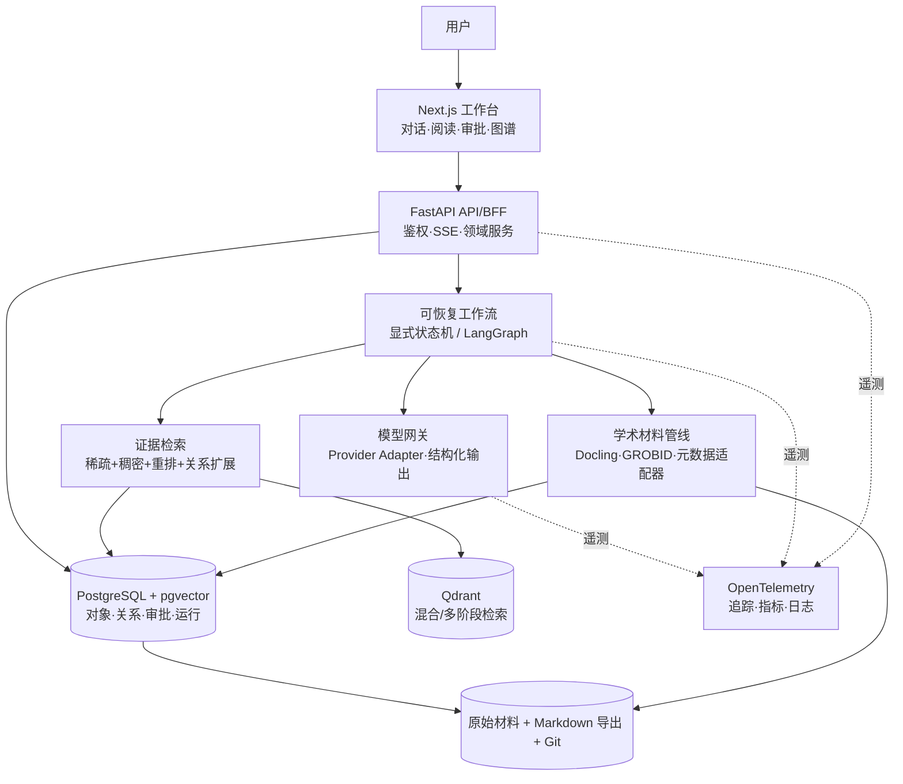
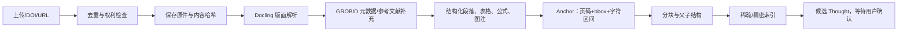
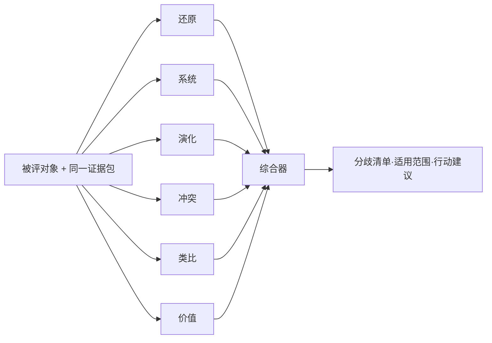

# Nexogenesis“思维承载体”技术栈与实施架构

> 文档版本：1.0  
> 基准日期：2026-07-24  
> 设计基线：ETP v1.0 系统手册、设计分析、WebAgent 路线与 AgentWeb 架构  
> 目标：把“对话中发生的思想”沉淀为可追溯、可修正、可复用、可演化的个人思维底座，而不是再做一个只有聊天记录的 AI 助手。

## 0. 结论先行

  Nexogenesis 的正确产品形态应当是“本地优先的证据型思维工作台”：对话、论文、笔记和用户修订进入同一个对象模型；系统先保存来源和证据锚点，再形成思想单元、综合与理论；AI 只负责候选生成、检索、比较和表达，用户保留思想归属、理论转正和规则修改的最终权力。

  推荐采用“TypeScript 交互层 + Python 智能内核 + PostgreSQL/Qdrant 索引层 + Markdown/Git 可迁移底座”的组合。日常闭环由显式状态机和审批节点强制，不能依赖提示词中的“请记得执行”；检索采用稀疏与稠密混合召回、重排和证据级引用；多 Agent、GraphRAG、视觉 RAG、自我优化都应在最小闭环被真实使用证明后再启用。

### 0.1 推荐栈总表

| 层 | 首选技术 | 在系统中的职责 | 采用时点 |
|---|---|---|---|
| Web 客户端 | TypeScript、React、Next.js App Router | 对话、审批、阅读、编辑、看板 | MVP |
| 思维编辑器 | Tiptap/ProseMirror | 结构化思想编辑、引用节点、批注 | MVP |
| 图谱交互 | React Flow | 理论、思想、证据与分歧的局部图 | MVP 后半 |
| 桌面封装 | Tauri 2 | 本地文件、系统托盘、离线桌面体验 | Web 闭环稳定后 |
| API/BFF | FastAPI、Pydantic v2、SSE | 类型化 API、流式输出、审批与文件上传 | MVP |
| 领域内核 | Python 3.12、纯领域服务 | ThoughtObject、权限、版本、证据链 | MVP |
| 工作流 | 显式状态机；LangGraph 检查点 | 可恢复流程、人机审批、六透镜隔离执行 | P1/P2 |
| 长期工作流升级 | Temporal | 跨天任务、分布式 worker、强恢复需求 | 出现明确运行证据后 |
| 事务与元数据 | PostgreSQL、SQLAlchemy 2、Alembic | 对象、关系、审批、运行与审计 | MVP |
| 向量检索 | pgvector 起步；Qdrant 增强 | 语义召回、稀疏/稠密融合、多阶段重排 | P1/P2 |
| 人类可读底座 | Markdown、YAML/JSON、Git | 可读、可 diff、可导出、可重建 | MVP |
| 原始材料 | 本地对象目录或 S3 兼容对象存储 | PDF、DOCX、网页快照、图片、音频 | MVP |
| 文档理解 | Docling 主解析；GROBID 学术补充 | 版面、表格、公式、引文与参考文献 | P1 |
| 中文/复杂 PDF 备选 | MinerU 或受控 OCR/VLM 通道 | 扫描件、中文公式密集材料的回退 | 按失败率启用 |
| 学术元数据 | Crossref、OpenAlex、Semantic Scholar | DOI、作者、引文、开放全文线索 | P1 |
| 文本检索模型 | BGE-M3 或经评测的托管嵌入模型 | 中文/多语稠密、稀疏、多向量表示 | P1 |
| 重排 | BGE reranker 或经评测的跨编码器 | 对召回候选做精排 | P1 |
| 模型接入 | 自建 Provider Adapter + JSON Schema | 多供应商、模型分层、结构化输出 | MVP |
| 工具协议 | MCP，外加权限白名单 | 学术数据、文件、浏览器和外部工具接入 | P2 |
| 可观测性 | OpenTelemetry + 可替换后端 | trace、metrics、logs、模型调用链 | MVP |
| 评测 | 自建黄金集 + pytest + RAGAS 辅助 | 检索、引用、流程、用户效用评测 | MVP |
| 部署 | Docker Compose；CI；定期备份 | 单用户或小团队可重复部署 | MVP |

## 1. 对 v1.0 目标的工程化解释

  本方案以 [AGENTS.md](./AGENTS.md)、[设计分析与梳理.md](./设计分析与梳理.md)、[webagent-roadmap.md](./webagent-roadmap.md) 和 [agentweb-architecture.md](./agentweb-architecture.md) 为需求源，同时吸收 [v1.0→v1.1 对照](../V1.1/前后对照.md) 暴露出的过度工程风险。

### 1.1 必须保留的产品内核

- 对话是思想的一等来源，不能只从阅读材料推断用户思想。
- 用户、系统、文档和外部节点的观点必须分开标注。
- 每个重要结论都能回到具体来源、页码、段落或对话轮次。
- 未解决的张力、反例和失效边界与“共识”同等重要。
- 用户确认是思想归属的闸门；AI 生成内容默认只是候选。
- 思想底座可读、可导出、可版本化，不被某个数据库或模型锁定。
- 判断的主要任务是定位解释范围、限制和生成力；对可核验事实仍应判断真伪。
- 系统规则只能在运行证据支持下演化，且变更可审计、可回滚。

### 1.2 需要修正的 v1.0 假设

| v1.0 假设 | 工程修正 |
|---|---|
| 所有高价值内容都强制跑完整六透镜 | 默认使用“直接回答 + 最强反例/限制”；只有高风险、跨领域因果、理论对抗或用户点名时升级 |
| 每个重要动作都写自然语言日志 | 业务事件自动结构化记录；只对异常、审批和规则变更写人类可读说明 |
| Markdown 是唯一运行时数据库 | Markdown/Git 保留为可迁移事实快照；PostgreSQL承担事务、并发、约束和查询，且必须能从导出包重建 |
| GraphRAG 是上下文问题的自然终点 | 先证明混合检索与关系扩展不够，再引入社区摘要型 GraphRAG |
| 六个透镜等于六个 Agent | 六个隔离任务即可；只有独立触发、独立状态和独立工具需求出现后才拆 Agent |
| 自我反思可以直接授权系统改结构 | 反思只产生有证据的变更提案；实质性结构和宪法变更仍由用户批准 |
| 生成问题数量代表生成力 | 改为后续复用、决策帮助、用户保留率与问题质量的组合指标 |

## 2. 核心对象模型：真正的“思维承载体”

  数据模型比模型品牌更重要。若只保存聊天消息和向量，系统无法可靠区分“用户相信什么”“文献说了什么”“AI 推断了什么”，也无法在用户修正后传播影响。

### 2.1 分阶段对象集

| 阶段 | 对象 | 说明 |
|---|---|---|
| MVP 必须 | `Source` | 原始对话、论文、笔记、网页或媒体 |
| MVP 必须 | `Anchor` | 页码、段落、字符区间、时间码、边界框与内容哈希 |
| MVP 必须 | `Thought` | `claim`、`question`、`tension` 三类用户可确认思想 |
| MVP 必须 | `Relation` | 支持、反驳、限定、派生、回答、相似、更新 |
| MVP 必须 | `Approval` | AI 候选的批准、驳回、修改与理由 |
| MVP 必须 | `Revision` | 对象版本、差异、操作者和因果来源 |
| P2 引入 | `Synthesis` | 针对问题或材料形成、可被继续修订的综合 |
| P2 引入 | `Judgment` | 透镜结果、分歧、价值评估与适用范围 |
| P2 引入 | `Divergence` | 不能被简单合并的立场分歧 |
| P3 引入 | `Theory` | 有命题、证据基、对手和失效边界的理论 |
| P3 引入 | `PolicyProposal` | 对工作流、透镜或权限规则的修改提案 |
| 全程存在 | `WorkflowRun` | 每次工作流的状态、模型、成本、错误与输出引用 |

### 2.2 ThoughtObject 最小契约

```json
{
  "id": "ulid",
  "type": "source | anchor | thought | synthesis | theory | judgment | divergence",
  "subtype": "claim | question | tension | null",
  "title": "string",
  "body": "markdown",
  "author_kind": "user | system | document | external",
  "epistemic_status": "asserted | inferred | hypothesis | disputed | verified",
  "lifecycle_status": "candidate | accepted | contested | dormant | deprecated",
  "provenance": [
    {
      "source_id": "ulid",
      "anchor_id": "ulid",
      "relation": "quotes | paraphrases | infers_from",
      "content_hash": "sha256"
    }
  ],
  "relations": [
    {
      "target_id": "ulid",
      "type": "supports | contradicts | limits | refines | answers | derived_from",
      "confidence": 0.0
    }
  ],
  "created_at": "RFC3339",
  "updated_at": "RFC3339",
  "schema_version": 1
}
```

  `confidence` 只能表示模型或流程的置信信息，不能伪装成客观真值。用户确认、事实核验和来源质量必须使用独立字段，不能混成一个总分。

### 2.3 关系与版本原则

- 所有关系必须有创建者、创建时间和依据；AI 推断的边不得伪装成人工关系。
- `deprecated` 不删除对象，但默认检索应降权；隐私删除请求属于例外，必须真正删除。
- 用户修改一个 Thought 时，新版本成为当前版本，旧版本仍可审计。
- 由旧版本派生的 Synthesis 和 Theory 标为 `possibly_stale`，进入集中复核，不自动静默重写。
- Markdown 导出包必须包含对象、关系、来源清单、schema 版本和校验哈希。

## 3. 总体架构



### 3.1 边界划分

- **交互层**只负责呈现、编辑、审批和局部图操作，不在浏览器中决定思想归属。
- **领域内核**负责对象状态、权限、版本和证据约束，不依赖具体 LLM 框架。
- **AI 工作流**负责候选生成与工具调用，所有写入都经领域内核校验。
- **检索层**返回证据候选，不直接生成最终回答。
- **索引层**可以重建；原始来源、批准对象、修订和导出包不可丢失。
- **模型层**可替换；业务逻辑不能写在某一家模型的私有消息格式里。

## 4. 前端技术栈

### 4.1 推荐组合

| 组件 | 技术 | 选择理由 |
|---|---|---|
| 应用框架 | Next.js App Router + React + TypeScript | 路由、服务端渲染、流式 UI 与组件生态完整 |
| UI | Tailwind CSS + Radix UI 或 shadcn/ui | 无障碍基础较好，便于形成自己的视觉系统 |
| 数据请求 | TanStack Query | 缓存、失效、后台刷新和服务端状态清晰 |
| 本地交互状态 | Zustand | 只承载编辑器和画布状态，避免复制服务端真相 |
| 富文本/块编辑 | Tiptap | 基于 ProseMirror，可定义 Thought、Citation、Tension 等节点 |
| 图编辑 | React Flow | 适合节点编辑、拖拽、局部展开和自定义边 |
| PDF 阅读 | PDF.js | 页码、文本层、高亮和边界框锚定 |
| 流式输出 | SSE | 单向 token/事件流简单可靠；协作编辑时再使用 WebSocket |
| 离线缓存 | IndexedDB | 暂存草稿、待上传材料和只读快照 |
| 桌面版 | Tauri 2 | 复用 Web UI，同时获得本地文件与系统集成 |

  Tiptap 能以 JSON 表示结构化内容，并支持 Markdown 导入导出；其协作方案使用 Yjs。Yjs/CRDT 只在出现跨设备离线合并或多人实时编辑需求时启用，不能为了“未来可能协作”提前让二进制更新日志取代可读的思想对象。相关能力见 [Tiptap 内容输出说明](https://tiptap.dev/docs/guides/output-json-html) 与 [协作扩展](https://tiptap.dev/docs/editor/extensions/functionality/collaboration)。

### 4.2 四个主视图

1. **对话工作台**：回答、当前立场、引用证据、保存候选和模型不确定性。
2. **材料阅读器**：原文与 AI 提取并排；点击引用跳到页码和边界框。
3. **思想库**：Thought、Synthesis、Theory 的版本、来源、关系和复用历史。
4. **审批与健康面板**：待确认候选、理论转正、规则提案、检索质量和成本。

  图谱不是主页，也不是知识质量的替代品。默认只显示围绕当前对象的一至两跳局部图；全局“毛线球”仅用于诊断。

## 5. 后端与工作流

### 5.1 Python 服务

  推荐 Python 3.12、FastAPI、Pydantic v2、SQLAlchemy 2 和 Alembic。选择 3.12 而不是路线图中的 3.13，是为了覆盖当前 GraphRAG 等 AI 组件的兼容范围，并降低二进制依赖安装风险。FastAPI 原生支持类型化 OpenAPI、SSE、WebSocket 与依赖式安全控制，适合同时承载普通 API 和 AI 流式调用。

### 5.2 领域服务

```text
kernel/
├── objects/        # ThoughtObject 与 schema
├── provenance/     # Anchor、哈希、引用链
├── approvals/      # 候选、批准、驳回、修改
├── revisions/      # 版本、差异、陈旧传播
├── policies/       # 三层权限与写入策略
├── retrieval/      # 检索接口，不绑定具体向量库
├── workflows/      # capture、answer、judge、theorize、review
└── exports/        # Markdown/JSON 导出与重建
```

### 5.3 工作流选型

  MVP 先用显式状态枚举和数据库事务实现最短闭环；需要暂停审批、故障恢复、并行透镜与“从检查点继续”时引入 LangGraph。其检查点和人工中断能力与 v1.0 的确认、审批、回放需求匹配，但领域对象和策略必须保持框架无关。[LangGraph 官方文档](https://docs.langchain.com/oss/python/langgraph/persistence)明确说明了检查点、人机协作、回放和故障恢复能力。

  Temporal 不作为首版依赖。只有当系统出现跨天批处理、多个 worker、外部 API 长时间重试、升级后仍需恢复旧工作流等需求时再迁移。Temporal 依靠事件历史重放实现持久执行，但工作流代码有确定性约束，接入成本明显高于单体状态机，见 [Temporal Workflow Execution](https://docs.temporal.io/workflow-execution)。

### 5.4 五条回路的代码化

| v1.0 回路 | 代码约束 |
|---|---|
| 感知必须落地 | 会话结束产生 `CaptureCandidate[]` 或显式 `no_capture_reason` |
| 建构必须触发判断 | 仅对达到升级条件的对象发出 `judgment.requested`，不再全量强制 |
| 判断必须回写 | `Judgment` 与对象版本建立不可为空的关系 |
| 入场必须带观点 | 回答请求记录使用了哪些 Thought/Theory；证据不足时明确无立场 |
| 全程必须留痕 | 状态转换、模型调用、审批和写入形成结构化事件，不要求逐动作长文 |

## 6. 学术材料摄入与证据链

### 6.1 摄入流水线



### 6.2 解析策略

- **Docling 为主解析器**：支持 PDF、DOCX、PPTX、表格、公式、OCR、阅读顺序和本地执行，代码采用 MIT 许可证；不同模型仍需单独检查许可证。见 [Docling 官方仓库](https://github.com/docling-project/docling)。
- **GROBID 为学术补充**：用于题名、作者、章节、引文标注和参考文献结构，不取代版面锚定。
- **MinerU/OCR/VLM 为回退**：仅在黄金 PDF 集上证明主解析失败后启用；必须记录解析器、模型版本和置信信息。
- **原始文件永不被解析结果覆盖**：解析产物可以重算，来源文件与哈希是证据根。
- **表格和图片保存双表示**：保留页面图像/边界框，同时保存结构化文本或表格；视觉模型的解释不能冒充原始数据。

### 6.3 学术元数据适配器

| 来源 | 用途 | 边界 |
|---|---|---|
| Crossref | DOI、出版信息、基金、许可证、更新/撤稿元数据 | 主要是元数据，不代表拥有全文权利 |
| OpenAlex | 作品、作者、机构、主题与开放学术图 | API 计费与快照更新策略需按当前条款配置 |
| Semantic Scholar | 论文、引用、推荐、部分 PDF/摘要线索 | 遵守 API 许可证、速率和字段限制 |

  Crossref 的公开 REST API 提供出版元数据，并建议缓存、退避和标识客户端；OpenAlex 提供学术实体与连接的开放目录；Semantic Scholar 提供论文、作者、引用、推荐和数据集接口。实现时应优先使用公开 API，不应以抓取 Google Scholar、CNKI 等网页作为生产依赖。参见 [Crossref REST API](https://www.crossref.org/documentation/retrieve-metadata/rest-api/)、[OpenAlex API](https://developers.openalex.org/) 和 [Semantic Scholar API](https://www.semanticscholar.org/product/api)。

### 6.4 证据锚点

```text
Anchor
├── source_id
├── source_version_hash
├── page_number
├── block_id
├── bbox: [x0, y0, x1, y1]
├── char_start / char_end
├── quoted_text
├── quoted_text_hash
├── parser_name / parser_version
└── created_at
```

  回答中的引用应指向 Anchor，而不是只指向整篇论文。原文变更或重新解析后，以哈希检查锚点是否漂移；失效引用进入修复队列。

## 7. 检索与学术 RAG

### 7.1 推荐检索链

```text
问题理解
→ 权限与范围过滤
→ 查询改写（保留原查询）
→ 稀疏召回 + 稠密召回
→ RRF 融合
→ 关系扩展一跳
→ 跨编码器/晚交互重排
→ 去重与上下文预算
→ 证据包
→ 带引用生成
→ 引用覆盖与来源一致性检查
```

  学术检索不能只用向量相似度。术语、作者、DOI、年份和精确短语需要词法通道，概念近似需要稠密通道；两者融合后再重排。Qdrant 官方文档支持稀疏/稠密混合、RRF/DBSF 融合和多阶段重排，并明确建议用独立评测集调权，而不是凭感觉调参数，见 [Hybrid Queries](https://qdrant.tech/documentation/search/hybrid-queries/)。

### 7.2 模型建议

- 中文与多语本地方案：BGE-M3 用于稠密、稀疏和多向量表示，另配 reranker。
- 托管方案：选择有中文/多语评测、版本固定和数据政策可接受的嵌入 API。
- 不把模型宣传分数当作本项目结论；必须在 Nexogenesis 自己的对话、中文论文和跨领域问题集上比较。
- 模型升级时并行建新索引，完成离线评测后再切流量，不原地覆盖旧向量。

  BGE-M3 论文报告其支持百余种语言、稠密/稀疏/多向量三种检索功能与最长 8192 token 输入；这说明它适合作为候选底座，不等于它在 Nexogenesis 语料上自动最优，见 [BGE-M3 论文](https://arxiv.org/abs/2402.03216)。

### 7.3 PostgreSQL、Qdrant 与图数据库的边界

| 情况 | 选择 |
|---|---|
| 单用户、语料较小、运维优先 | PostgreSQL + pgvector |
| 需要稀疏/稠密/多向量统一查询和复杂多阶段重排 | PostgreSQL + Qdrant |
| 主要是对象关系查询与一至两跳扩展 | PostgreSQL 关系表 + 递归查询/NetworkX |
| 出现高频深层图遍历、社区算法和图查询 SLO 压力 | 再评估 Neo4j 等图数据库 |

  pgvector 能把向量与事务数据放在同一 PostgreSQL 中，并支持精确与近似最近邻；它适合作为起步方案，见 [pgvector 官方仓库](https://github.com/pgvector/pgvector)。是否升级 Qdrant 或图数据库，应由同一评测集上的召回率、延迟、过滤正确性和运维成本决定。

### 7.4 GraphRAG 的进入条件

  Microsoft GraphRAG 会从文本中抽取实体、关系和声明，做社区发现并生成分层摘要；其官方文档同时警告索引会消耗大量 LLM 资源。因此它应解决“跨大量对象的全局主题、群落和关系问题”，不能替代普通混合检索，也不应对每条私人对话全量运行。见 [GraphRAG 概览](https://microsoft.github.io/graphrag/index/overview/) 与 [入门警告](https://microsoft.github.io/graphrag/get_started/)。

  满足以下全部条件才启用：

- 黄金问题集中有稳定的全局关系问题，普通检索 + 一跳扩展持续失败；
- 对实体消歧和关系抽取已有人工抽检流程；
- 增量索引成本、隐私和错误传播可以接受；
- GraphRAG 在留出集上相对基线有可重复提升。

### 7.5 视觉检索的进入条件

  ColPali 类方法把整页图像表示为多向量，适合版面、表格和图形对答案至关重要的文档；它不是普通文本检索的无条件替代品。只有当“正确页面找不到”的主要原因被证实为视觉信息丢失时，才为相关语料增加页面图像检索，并保留文本通道用于引用和可解释性。参见 [ColPali 论文](https://arxiv.org/abs/2407.01449)。

## 8. 生成、判断与“思维体”

### 8.1 模型网关

```python
class ModelProvider(Protocol):
    async def generate(
        self,
        *,
        messages: list[Message],
        response_schema: type[BaseModel] | None,
        tools: list[ToolSpec],
        model_policy: ModelPolicy,
        trace_context: TraceContext,
    ) -> ModelResult: ...
```

  模型策略按任务分层：

| 任务 | 模型要求 |
|---|---|
| 分类、去重、结构提取 | 快、便宜、结构化输出稳定 |
| 对话蒸馏候选 | 能区分说话者、保留原意和不确定性 |
| 证据重排/核对 | 相关性与引用判断稳定 |
| 综合、理论对抗 | 长上下文、推理与多来源综合能力强 |
| 隐私材料 | 允许本地部署或符合数据处理要求 |

  不在架构文档中固定某个“最强模型”。模型、价格、上下文与政策变化快，生产配置应由 `model_registry` 管理，并记录供应商、模型版本、参数、提示版本、输入证据和输出哈希。

### 8.2 带观点入场

  入场不是把整个 Profile 塞进提示词，而是在权限和 token 预算内构造可审计的 Context Package：

```json
{
  "question": "...",
  "relevant_thoughts": ["..."],
  "active_questions": ["..."],
  "candidate_theories": ["..."],
  "counterevidence": ["..."],
  "source_anchors": ["..."],
  "retrieval_trace_id": "...",
  "context_budget": {"used_tokens": 0, "max_tokens": 0}
}
```

  系统必须区分“用户已确认思想”“从用户历史推断”“文献观点”和“本轮 AI 假设”。如果证据不足，应说没有稳定立场，而不是为了符合入场协议虚构人格。

### 8.3 六透镜的实现



- 每个透镜运行在独立任务中，只接收被评对象、证据包和自身 rubric。
- 六个任务可以并发，但不是六个拥有长期人格和私有记忆的 Agent。
- 综合器必须保留分歧，不能用多数投票消灭少数视角。
- 事实问题允许引用外部证据判定支持或不支持；价值与理论问题再做范围定位。
- 透镜输出先过 JSON Schema 和引用校验，失败可重试，不能直接写入思想库。

### 8.4 多 Agent 的进入条件

  当前行业中的多 Agent 能扩大并行探索，但也增加调用成本、状态同步、错误放大和调试难度。Nexogenesis 首先采用“单编排器 + 工具 + 隔离任务”。只有角色出现独立事件源、独立权限、独立长期状态或需要并发自治时，才拆分 Scribe、Librarian、Panel、Theorist 等角色。多 Agent 辩论不能保证减少幻觉，最终仍需证据和评测。

### 8.5 MCP 的位置

  MCP 用于把学术 API、文件、浏览器、参考文献管理器和后续插件暴露成统一工具，不负责替系统选择上下文或保证工具安全。MCP 是基于 JSON-RPC 的客户端—主机—服务器协议，定义 tools、resources、prompts 等交换原语；本系统仍需自行实施白名单、最小权限、审批、超时和结果净化，见 [MCP 架构](https://modelcontextprotocol.io/docs/learn/architecture)。

## 9. 数据一致性、可逆性与本地优先

### 9.1 写入顺序

1. 创建不可变命令与幂等键。
2. 在 PostgreSQL 事务中写对象新版本、关系和 outbox 事件。
3. worker 消费 outbox，更新向量/图索引。
4. 生成或更新 Markdown 导出快照。
5. 完成一个用户可理解的任务后创建 Git 提交或版本标签。

  不能在每次模型 token 或每条低层事件后 Git commit；这会制造噪声，也不能代替数据库事务。Git 用于人类可读工件的版本与导出快照，业务事件使用结构化审计表。

### 9.2 可重建测试

- 每次发布在空数据库执行“从导出包重建”集成测试。
- 随机抽取对象，比较 ID、版本、关系、来源哈希与当前库。
- 向量索引、缓存和 GraphRAG 摘要不进入不可替代数据清单。
- 原始材料单独备份；Git 不适合保存大量二进制 PDF。

### 9.3 本地与云端模式

| 模式 | 组成 |
|---|---|
| 本地开发/个人版 | Docker Compose + 本地文件 + PostgreSQL + 可选 Qdrant |
| 桌面版 | Tauri 壳 + 本地 API sidecar；默认环回地址，不开放公网 |
| 小团队私有部署 | 反向代理、OIDC、PostgreSQL、Qdrant、对象存储、备份 |
| 托管版 | 每租户逻辑隔离、密钥托管、用量审计、数据驻留与删除流程 |

  Tauri 能复用 HTML/CSS/JavaScript 前端并使用系统 WebView，适合在 Web 产品闭环稳定后封装桌面客户端；它不会自动解决 Python sidecar、更新签名和本地数据库迁移问题，见 [Tauri 2 官方说明](https://v2.tauri.app/start/)。

## 10. 安全、隐私与学术合规

### 10.1 必须实现

- 原始材料、抽取文本、提示和遥测按同一敏感等级管理。
- API key 仅在服务端/系统密钥库中保存，不写进仓库和浏览器。
- 检索前执行租户、项目、文档 ACL 过滤，不能生成后再过滤引用。
- 外部文档中的“指令”一律视为数据，防止检索型提示注入。
- MCP/浏览器/文件工具使用白名单、参数 schema、超时、结果大小和审计。
- 导出、联邦交换、删除与模型训练分别授权；默认不用于训练。
- 保存许可证、开放获取状态、撤稿/更正信息和采集时间。
- 用户要求删除私人来源时，同步删除原件、解析物、索引、缓存和可识别备份记录。

### 10.2 不能承诺

- RAG 不能消除幻觉。
- 引用存在不代表引用支持对应句子。
- 图谱中的边不自动等于因果关系。
- 多 Agent 共识不自动等于事实。
- 外部记忆和持续写库不等于模型参数层面的持续学习。
- 开源代码不等于模型权重、数据和商业使用均无限制。

## 11. 可观测性与评测

### 11.1 追踪

  使用 OpenTelemetry 为一次用户请求生成贯穿 API、检索、解析、工作流和模型调用的 trace。OpenTelemetry 是供应商中立的 traces、metrics、logs 采集与导出框架，不是最终的可视化后端，见 [OpenTelemetry 官方说明](https://opentelemetry.io/docs/what-is-opentelemetry/)。

  每个模型 span 至少记录：

- `workflow_run_id`
- 模型与提示版本
- 输入/输出 token 和费用
- 缓存命中
- 工具调用与错误分类
- 证据 Anchor ID，不记录不必要的原文
- 结构化输出校验结果
- 用户是否接受或修正

### 11.2 黄金评测集

| 集合 | 最小内容 |
|---|---|
| 解析集 | 中文/英文、扫描/原生、表格/公式/双栏 PDF，人工页级真值 |
| 检索集 | 问题—相关 Anchor 对，含术语、概念、跨文档与反例问题 |
| 引用集 | 结论—支持/不支持证据对，人工标注完整性 |
| 思想归属集 | 用户观点、文献观点、系统观点和不确定表达 |
| 工作流集 | 批准、驳回、修改、失败恢复和重复请求 |
| 效用集 | 真实历史问题、用户保留内容和后续复用记录 |

### 11.3 指标

| 环节 | 核心指标 |
|---|---|
| 解析 | 阅读顺序、表格单元格、引用与页码锚定准确率 |
| 检索 | Recall@k、nDCG@k、MRR、反证召回率、延迟 |
| 生成 | 事实正确性、引用覆盖率、引用支持率、不可证实陈述率 |
| 归属 | 说话者/作者分类准确率、用户纠正率 |
| 思维承载 | 候选保留率、旧 Thought 有效复用率、修订传播正确率 |
| 工作流 | 完成率、恢复率、重复写入率、审批等待时间 |
| 运营 | token/请求、费用/完成任务、P50/P95 延迟 |
| v1.0 健康 | 思维体产出吸收率、理论真实引用率，作为诊断而非授权阈值 |

  RAGAS 可用于加快 RAG 评测迭代，但自动 judge 不能取代黄金集和人工抽检。其论文把评测拆为检索上下文、忠实使用上下文和生成质量等维度，适合作为辅助框架，见 [RAGAS 论文](https://arxiv.org/abs/2309.15217)。

  引用质量必须单独测试。ALCE 将长文本引用评测拆为流畅度、正确性和引用质量，并显示即使强模型也仍有明显的引用支持缺口；因此“回答里有脚注”不能作为验收条件，见 [ALCE 论文](https://arxiv.org/abs/2305.14627)。

## 12. 推荐仓库结构

```text
nexogenesis/
├── apps/
│   ├── web/                  # Next.js
│   └── desktop/              # Tauri，后置
├── services/
│   ├── api/                  # FastAPI
│   └── worker/               # 解析、索引、长任务
├── packages/
│   ├── ui/                   # 共用 UI
│   ├── contracts/            # OpenAPI/JSON Schema 生成物
│   └── config/
├── nexogenesis/
│   ├── kernel/
│   ├── workflows/
│   ├── retrieval/
│   ├── ingestion/
│   ├── model_gateway/
│   ├── tools/
│   └── evals/
├── schemas/
├── prompts/                  # 版本化工件，禁止散落在代码中
├── evalsets/                 # 脱敏、小规模、可复现
├── migrations/
├── exports/                  # Markdown/JSON，可由用户指定到外部目录
├── infra/
│   ├── compose/
│   └── otel/
└── tests/
```

## 13. 实施路线

### Phase 0：设计契约与评测基线

  交付：

- ThoughtObject、Anchor、Approval、Revision 的 JSON Schema。
- 20—50 个真实历史问题组成的首版效用集。
- 10—20 份代表性学术文档组成的解析/检索集。
- Markdown/JSON 导出规范和空库重建测试。
- 模型 Provider 接口、成本与数据策略表。

  退出条件：

- 对象归属、来源锚点和用户审批没有语义歧义。
- 不接 LLM 也能手工创建、修改、导出和重建 Thought。

### Phase 1：最小思维闭环

  交付：

- 对话、材料上传、候选 Thought、用户审批、搜索和带引用回答。
- `claim/question/tension` 三类对象。
- PostgreSQL、pgvector、原始材料目录、Markdown 导出和 Git 快照。
- FastAPI + Next.js + Tiptap；SSE 流式回答。
- OpenTelemetry、结构化模型输出和首版离线评测。

  退出条件：

- 完成至少 20 次真实对话。
- 能回答“哪些候选被保留、哪些旧思想帮助了新回答、用户纠正多少次、维护花多少时间”。
- 删除索引后可以从来源与导出包重建。

### Phase 2：学术 AI 与可靠工作流

  交付：

- Docling/GROBID 摄入、Crossref/OpenAlex/Semantic Scholar 适配器。
- 稀疏 + 稠密 + 重排检索；Qdrant 是否引入由评测决定。
- Anchor 级引用、引用支持/覆盖检查、撤稿和更新标记。
- LangGraph 检查点、审批中断、失败恢复和幂等写入。
- Synthesis、Judgment 与按需六透镜。

  退出条件：

- 混合检索在留出集上稳定优于单一向量基线。
- 引用能跳回正确页和原文区域。
- 暂停审批、服务重启和重复请求不会产生重复思想对象。

### Phase 3：理论生态与反思

  交付：

- Theory、Divergence、失效边界、竞争关系与价值轨迹。
- 理论看板、局部图谱、集中 review 和规则变更提案。
- 历史 Thought 变更对综合/理论的陈旧传播。
- 提示/rubric 的影子评测与严格晋级门。

  退出条件：

- 普通 Thought/Synthesis 已不足以表达的真实案例持续出现。
- 理论对象被后续对话实际引用，而不是只在看板中堆积。
- 新旧提示在留出集和真实审批数据上有可复现差异。

### Phase 4：条件式增强

  按证据分别启用：

- GraphRAG：全局关系问题稳定失败。
- ColPali/视觉 RAG：视觉信息丢失是主要召回瓶颈。
- Temporal：跨天和分布式工作流需要强持久执行。
- Yjs：真实出现多人或离线并发编辑。
- 多 Agent：独立状态、权限和事件源已经形成。
- 本地小模型训练：审批数据、任务集、算力和可验证奖励均成熟。

### Phase 5：多用户与联邦

  交付：

- OIDC、租户隔离、项目 ACL、密钥和用量治理。
- 可出口建构包、签名、脱敏、逐项审批和导入隔离区。
- Publish/Duel/Graft 协议原型。

  联邦层必须最后做。私人思想底座的隐私、归属与语境风险高于一般知识库；没有成熟的本地证据链、权限与删除机制时，不应开始节点交换。

## 14. 明确不推荐的方案

- 用“一个超长系统提示词 + 一个聊天页面”实现全部闭环。
- 一开始就部署八个专职 Agent、消息总线、Neo4j、GraphRAG 和 Kubernetes。
- 只保存向量，不保存可验证原文和结构化对象。
- 让 LLM 直接改 Markdown、数据库或宪法文件而不经 schema、权限和审批。
- 把聊天摘要当成用户人格档案，并在未来回答中无条件注入。
- 用单一“相关性分数”混合事实真值、用户认同和模型置信。
- 用固定 30 轮、10 会话、30% 等阈值作为永久业务真理。
- 以 RAGAS、LLM-as-judge 或多 Agent 投票作为唯一验收。
- 未核验许可证就打包解析模型、嵌入模型或商业全文。
- 把 CDN、模型供应商、向量库或协作服务变成无法导出的事实之源。

## 15. 最终推荐

  若现在开始实现，最合理的第一版不是 v1.0 全器官的完整数字化，而是“v1.0 目标、v1.1 复杂度纪律、2026 学术 AI 证据链”的组合：先交付 Source → Anchor → Thought → Approval → Retrieval → Cited Answer 的最小闭环；随后再恢复 Judgment、Theory、Divergence 和 Reflection。这样既没有放弃“思维承载体”的长期目标，也让每一层复杂度都能用真实使用数据证明。

  技术上的关键不在于选到一个永不过时的模型，而在于建立四个不变量：思想归属明确、证据锚点可回溯、工作流可恢复、数据可迁移。只要这四点进入对象模型、API、测试和部署流程，模型、向量库与 Agent 框架都可以随技术发展替换，而 Nexogenesis 的思想底座不会随之失忆。

## 16. 主要事实来源

### 学术 AI 与检索

1. [Docling 官方仓库与技术能力](https://github.com/docling-project/docling)
2. [GROBID 文档](https://grobid.readthedocs.io/)
3. [BGE-M3 论文](https://arxiv.org/abs/2402.03216)
4. [Qdrant Hybrid Queries](https://qdrant.tech/documentation/search/hybrid-queries/)
5. [Microsoft GraphRAG 官方文档](https://microsoft.github.io/graphrag/)
6. [ColPali 论文](https://arxiv.org/abs/2407.01449)
7. [RAGAS 论文](https://arxiv.org/abs/2309.15217)
8. [ALCE 引用评测论文](https://arxiv.org/abs/2305.14627)

### 学术数据接口

9. [Crossref REST API](https://www.crossref.org/documentation/retrieve-metadata/rest-api/)
10. [OpenAlex 开发者文档](https://developers.openalex.org/)
11. [Semantic Scholar Academic Graph API](https://www.semanticscholar.org/product/api)

### 工程基础

12. [FastAPI 官方文档](https://fastapi.tiangolo.com/)
13. [Next.js App Router 文档](https://nextjs.org/docs/app)
14. [Tiptap 官方文档](https://tiptap.dev/docs)
15. [React Flow 官方文档](https://reactflow.dev/)
16. [pgvector 官方仓库](https://github.com/pgvector/pgvector)
17. [LangGraph 持久化文档](https://docs.langchain.com/oss/python/langgraph/persistence)
18. [Temporal Workflow Execution](https://docs.temporal.io/workflow-execution)
19. [Model Context Protocol 架构](https://modelcontextprotocol.io/docs/learn/architecture)
20. [OpenTelemetry 官方文档](https://opentelemetry.io/docs/)
21. [Tauri 2 官方文档](https://v2.tauri.app/start/)

## 17. 事实边界说明

  本文对技术能力的描述以截至 2026-07-24 可访问的官方文档、项目仓库和原始论文为依据；具体版本、价格、API 限额和许可证可能变化，实施时必须锁定版本并复核。涉及“适合 Nexogenesis”“何时引入”和“推荐顺序”的内容属于基于 v1.0/v1.1 需求与工程风险做出的架构判断，不是相关项目官方给出的保证。

  本技术栈旨在降低错误和不可追溯性，不能保证 AI 输出没有事实性错误。可靠性来自来源锚定、混合检索、结构校验、引用评测、人工审批和持续回归测试的共同作用，而不是来自任何单一模型或框架。
